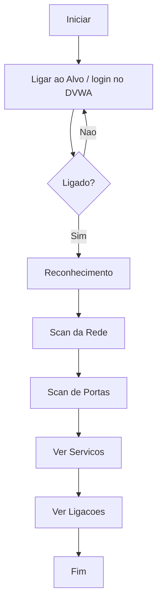

# Documentacao Tecnica e Academica

Este documento liga os conteudos da unidade curricular ao projeto
**Scanner de Pentest**, de forma simples e aplicada.

---

## 1. Ciclo de vida do software e metodologia

Todo o software passa por fases: planeamento, analise, desenho,
codificacao, testes e manutencao. A isto chama-se **ciclo de vida do
software**.

Neste projeto seguiu-se uma abordagem **iterativa**: construir uma parte,
testar contra o DVWA, corrigir e melhorar. Por exemplo, o reconhecimento
primeiro mostrava valores fixos; depois de testar, passou a ler os dados
reais do alvo. Essa repeticao de "fazer -> testar -> melhorar" e a base
das metodologias ageis.

---

## 2. Planeamento das etapas de desenvolvimento

O projeto foi dividido em etapas claras antes de escrever codigo:

1. Decidir o objetivo: explorar Command Injection no DVWA.
2. Separar o projeto em modulos (login, ataques, interface).
3. Implementar uma funcionalidade de cada vez.
4. Testar cada uma contra o DVWA.
5. Documentar e preparar para entrega.

---

## 3. Estruturacao de dados

Os dados recolhidos do alvo sao guardados em **dicionarios** Python (pares
nome/valor). Por exemplo, o reconhecimento devolve um dicionario com o
utilizador, o IP, a rede, a lista de utilizadores e o nome do servidor.
Estruturar os dados assim mantem a informacao organizada e facil de reutilizar
(por exemplo, o primeiro dispositivo encontrado no scan da rede e passado
automaticamente para o scan de portas).

---

## 4. Algoritmia: principios, sintaxe e semantica

Um **algoritmo** e uma sequencia de passos para resolver um problema. O scan
de portas, por exemplo, segue este algoritmo: para cada porta da lista, tenta
ligar; se ligar, marca como aberta; no fim, mostra o total.

- **Sintaxe** e a forma correta de escrever o codigo (as regras da linguagem).
  Um `:` em falta num `for` e um erro de sintaxe.
- **Semantica** e o significado do que se escreve. Um codigo pode estar
  sintaticamente correto mas fazer a coisa errada (erro de semantica).

---

## 5. Fluxograma do programa

Um **fluxograma** e um desenho que mostra o caminho que o programa percorre.

---

## 6. Wireframing e prototipos

**Wireframe** e o rascunho da interface antes de a construir: onde ficam os
botoes, o campo do alvo e a area de output. O prototipo deste projeto definiu
tres zonas: barra do alvo no topo, botoes de acoes no meio e a janela de
output em baixo. A interface final em Tkinter seguiu esse desenho.

---

## 7. Fases de desenvolvimento de um programa

1. **Identificacao** — perceber o problema: demonstrar Command Injection.
2. **Elaboracao do algoritmo** — definir os passos de cada ataque.
3. **Codificacao** — escrever o codigo em Python.
4. **Debug** — encontrar e corrigir erros (ex.: limpar o lixo do ping que
   aparecia na lista de utilizadores).
5. **Testes** — correr contra o DVWA e confirmar os resultados.
6. **Otimizacao** — melhorar (ex.: tornar o scan de portas mais fiavel).

---

## 8. Ambiente de desenvolvimento

- **Editor de texto / IDE:** foi usado o VS Code. Um editor moderno ajuda com
  realce de sintaxe (cores que distinguem partes do codigo), autocompletar,
  deteccao de erros e integracao com o Git.
- **Instalacao e configuracao:** Python instalado, dependencias via
  `pip install -r requirements.txt`, e o XAMPP para o servidor local.

---

## 9. Servidor web e servidor virtual

- **Servidor web** — programa que responde a pedidos HTTP e entrega paginas.
  Aqui e o **Apache** (incluido no XAMPP), que serve o DVWA em
  `http://localhost/dvwa`.
- **Servidor virtual** — um servidor que corre dentro do proprio computador,
  em vez de uma maquina separada. O XAMPP cria esse ambiente local, o que
  permite testar os ataques em seguranca, sem tocar em sistemas reais.

---

## 10. Testes de funcionamento

Cada funcionalidade foi testada contra o DVWA para confirmar que fazia o
esperado: o login autenticava, o reconhecimento trazia dados reais, o scan
da rede encontrava dispositivos e o scan de portas identificava portas
abertas. Os erros encontrados nos testes (como a lista de utilizadores suja)
foram corrigidos na fase de debug.

---

## 11. Protecao de dados (RGPD) e normas aplicaveis

O **RGPD** (Regulamento Geral de Protecao de Dados) protege os dados pessoais
das pessoas na Uniao Europeia. Uma ferramenta que recolhe informacao de
sistemas tem de ter cuidado com isso.

Neste projeto aplicou-se esse principio de duas formas:

- **Ambiente controlado:** so e usado contra o DVWA, um alvo proprio e
  autorizado. Nao se recolhem dados de terceiros.
- **Camuflagem na apresentacao:** o IP, o nome da maquina e as contas
  pessoais sao escondidos atras de nomes genericos, para nao expor dados reais.

**Normas e boas praticas relacionadas:** testar apenas com autorizacao
expressa (principio base do pentest etico), minimizar a recolha de dados e
nunca usar a ferramenta fora de um ambiente controlado.
